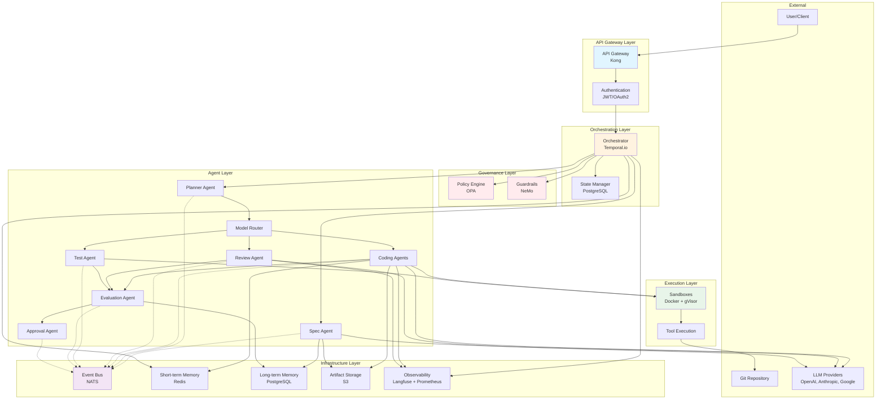
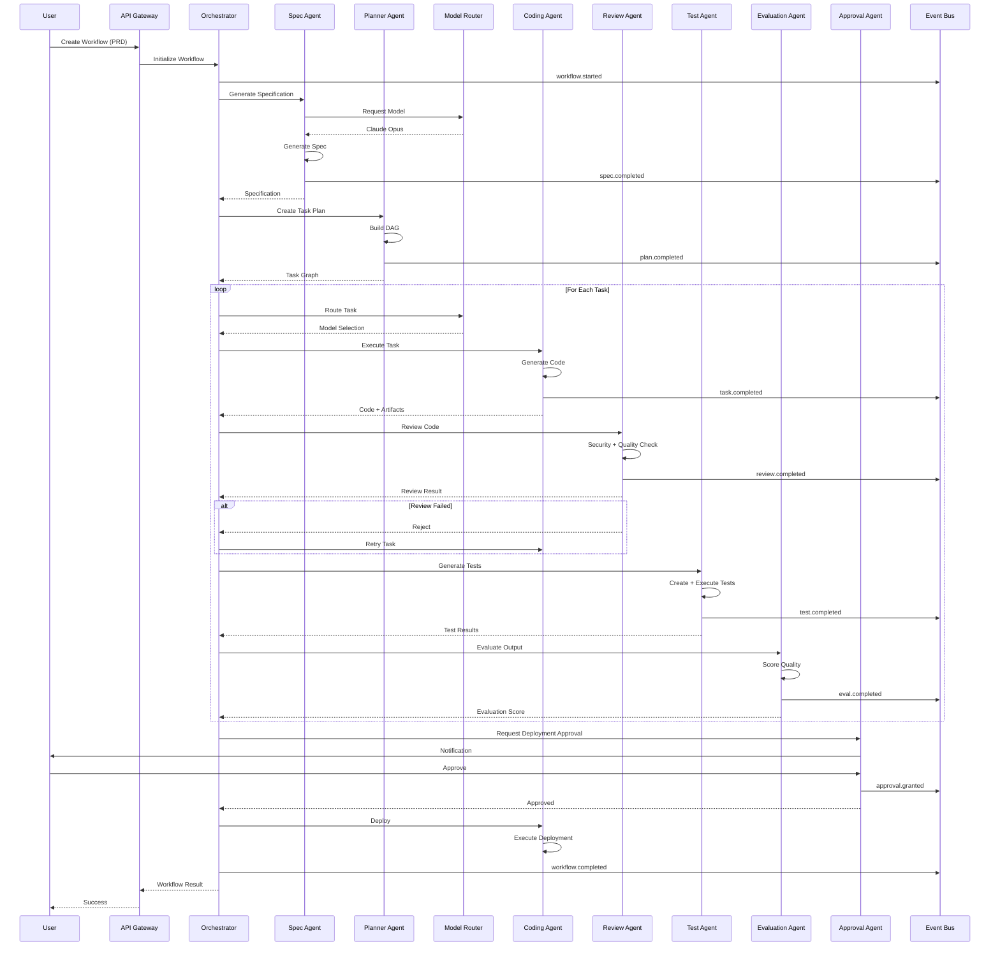
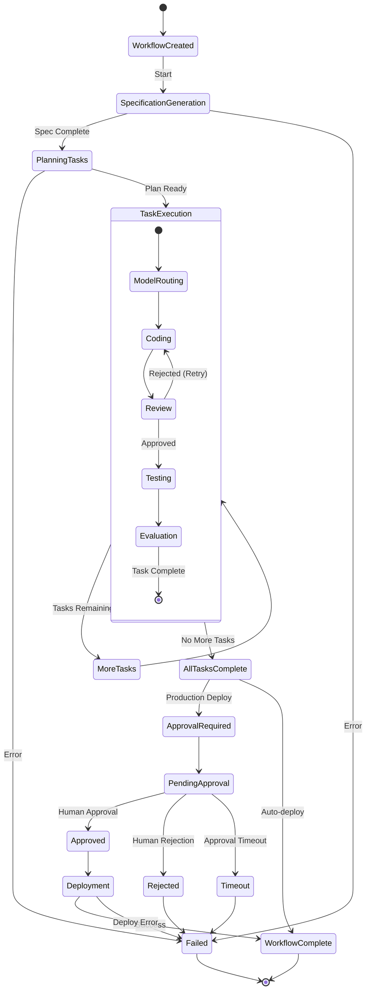
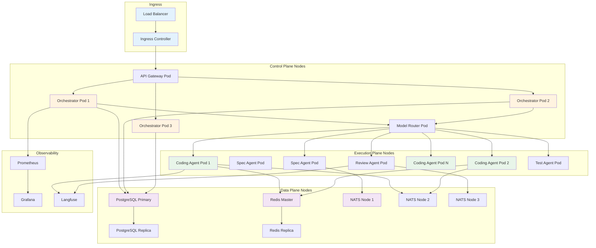
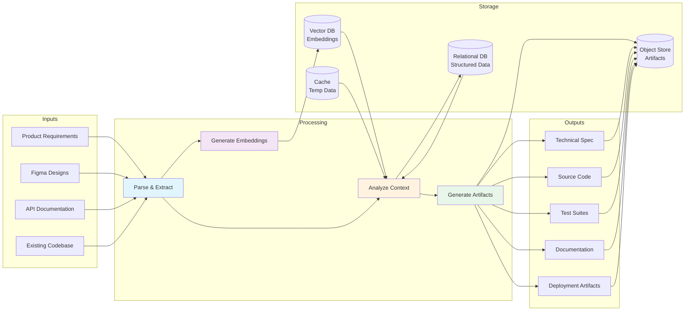
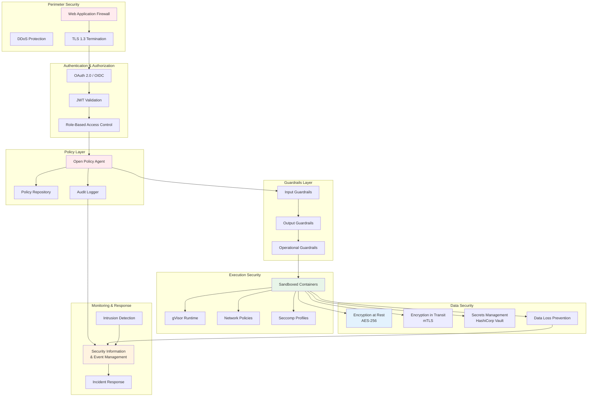
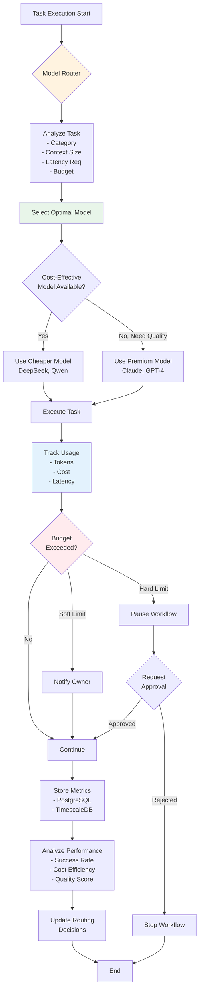

# Multi-Agent Platform - Architecture Diagrams

This directory contains visual representations of the system architecture using Mermaid diagrams.

## Diagrams

1. **System Architecture Overview** - High-level view of all components
2. **Agent Interaction Flow** - How agents communicate and coordinate
3. **Workflow Execution Sequence** - Step-by-step workflow execution
4. **Deployment Architecture** - Kubernetes deployment structure
5. **Data Flow** - How data flows through the system
6. **Security Architecture** - Security layers and controls

---

## 1. System Architecture Overview

---

## 2. Agent Interaction Flow

---

## 3. Workflow Execution Sequence (Detailed)

---

## 4. Deployment Architecture (Kubernetes)

---

## 5. Data Flow Architecture

---

## 6. Security Architecture

---

## 7. Cost Tracking & Optimization Flow

---

## Diagram Rendering

These Mermaid diagrams can be rendered in:
- GitHub README files (native support)
- VS Code with Mermaid extensions
- Online tools like [Mermaid Live Editor](https://mermaid.live/)
- Documentation sites (GitBook, MkDocs, etc.)
- Exported to PNG/SVG using Mermaid CLI

---

## Updating Diagrams

When updating diagrams:
1. Edit the Mermaid syntax in this file
2. Validate syntax in Mermaid Live Editor
3. Update version/date in commit message
4. Link to diagrams from main documentation

---

**Last Updated:** 2026-06-18  
**Version:** 1.0.0
